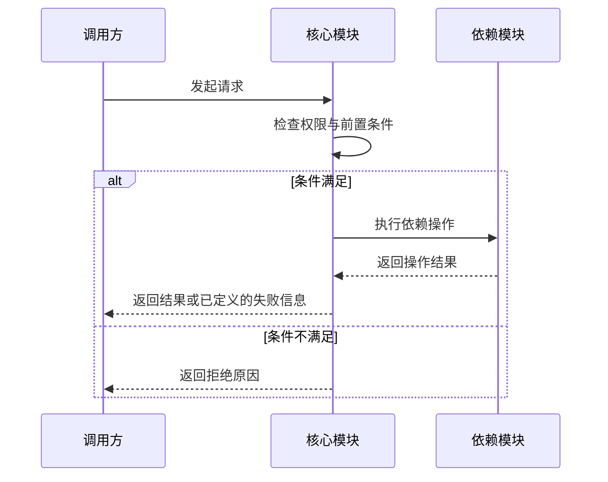

# 技术设计：{产品／功能名称}

> 模板说明（正式成文时连同本提示删除）：这份文档先让人读懂，再让 AI 检查实现与验证是否闭环。复制到项目规定位置后填写。
> 简单改动保持短小；不要为了套模板引入无关的服务、数据表、术语、图或流程。
> “使用原则”“编号说明”“交接检查”是起草说明，正式成文时删除，检查结果放在交付摘要中。

## 0. 文档信息

| 项目 | 内容 |
|---|---|
| 版本／状态 | {v0.1}／{草稿、评审中、已批准、已取代} |
| 适用范围 | {系统、模块或功能} |
| 负责人／批准人 | {姓名或角色}／{未批准写“—”} |
| 最后更新 | {YYYY-MM-DD HH:mm} |
| 对应 PRD | [PRD](./PRD.md) {版本；sha256=64 位十六进制值} |
| PRD 状态 | {当前／需要复核／无法确认；写明原因} |
| 对应 UI 规范 | [UI 设计规范](./UI设计规范.md) {版本／不适用} |
| 仓库基线 | {仓库、分支、代码版本（commit）、是否有未提交修改} |
| 交接结论 | {可以进入实施计划／暂不能进入／被阻塞；写明原因} |

> sha256 是文件内容校验值，按 PRD 原始 UTF-8 字节计算。它用于确认设计对应哪一版需求，不代表需求已批准。

### 使用原则

- 先写方案结论和影响，再写实现细节；标题和正文优先使用普通中文。
- 技术词第一次出现时用一句中文解释。例如“幂等”说明为“重复操作只生效一次”。
- 一句话能说明时不用画图；核心模块的多步处理或关键分支必须配流程图，跨模块调用用时序图，关键状态转换用状态图。已有图覆盖时引用即可，不为每个模块凑齐所有图种。
- 一句话或短列表能说清时不用表格。表格只用于比较选择、字段对应或需求追踪。
- 删除不适用章节，不要保留整页“不适用”。没有数据、接口、迁移或部署变化时，不为它们创建空章节。
- 简单改动通常只需要：改什么、当前情况、实现方法、涉及文件、边界情况和验证方式；通常不新增技术决定编号。
- 当前实现和目标方案分开。看到目录、配置或测试不等于功能已经运行。
- 本文负责实现方案；产品行为引用 PRD，执行状态和实际证据放在任务清单。
- 精确依赖版本以依赖锁定文件（lockfile）、运行时版本文件或镜像摘要为准，不写 `latest`。

### 编号说明

读者不用记住这些缩写；引用时同时写中文名称。不要为每一段文字编号。

| 示例 | 中文含义 | 何时需要 |
|---|---|---|
| F-001／BR-001 | 功能／业务规则 | 直接沿用 PRD，不在这里重写正文 |
| AC-001／NFR-001 | 验收／非功能要求 | 说明本方案如何满足和验证 |
| PERM-001／DATA-001 | 权限／业务数据 | 相关边界确实受影响时 |
| ADR-001 | 重要技术决定 | 存在多个合理选项且取舍会长期影响项目时 |
| VERIFY-001 | 验证项 | 需要在任务或报告中稳定引用时 |
| TASK-001 | 任务 | 只引用任务清单，不在本文维护进度 |

---

## 1. 方案摘要

- 要解决的问题：{引用 PRD 编号并用一句话说明}
- 当前情况：{现有实现或“尚无实现”}
- 方案结论：{准备怎么做}
- 主要影响：{用户、模块、数据、接口或运行环境}
- 明确不改：{兼容和保护范围}
- 仍待决定：{真正影响方案的选择；没有则写“无”}

让不了解实现细节的人只读本节，也能知道为什么改、改哪里和主要风险。

---

## 2. 当前状态与证据

只记录实际查看过的代码、配置、数据结构、测试或运行结果。简单改动可以用短列表代替表格。

| 范围 | 当前情况 | 证据 | 与目标的差距 |
|---|---|---|---|
| {模块或流程} | {已存在、占位、未实现等} | {文件、commit、命令或结果} | {需要改变什么} |

已确认约束：

- {兼容版本、团队维护、部署环境、法规或既有公共约定}

当前假设：

- {可逆、低风险的假设及复核条件；没有则删除}

### 2.1 关键质量与容量目标（有明确要求或准备上线时）

有明确目标，或正式服务准备上线时保留本节。没有数字依据时标记待确认，不编造吞吐量、延迟或可用性指标。

| 需求与来源 | 当前基线 | 目标及适用条件 | 设计措施 | 验证与运行观察 |
|---|---|---|---|---|
| {NFR 编号；PRD、合同或证据} | {实测值／待测} | {目标；负载、数据量和时间窗口} | {本方案如何满足} | {验证方法、指标或告警} |

---

## 3. 关键技术决定（有重要取舍时）

只有存在两个以上合理方案，且选择会长期影响维护、数据、接口或部署时才写本节。

| 技术决定 | 选择 | 状态 | 为什么这样选 | 何时重新评估 |
|---|---|---|---|---|
| ADR-001 技术决定 | {选择} | {建议／已批准／已取代／已拒绝} | {约束、证据和主要取舍} | {触发条件} |

被拒绝的方案只写关键原因，不写长篇技术综述。

---

## 4. 实现方案

### 4.1 主要流程

{用 3 至 8 个步骤说明调用、处理、保存和用户可见结果。异步、离线或重试流程确实存在时另写。}

逐个检查本次核心模块的主要场景，按上方规则配流程图或时序图，覆盖已知的关键分支及失败去向。架构总览不能替代核心模块流程图；单步改动无需配图。图中区分当前状态与目标方案，在图旁用短句说明结论及关联需求。

> 模板说明：以下仅展示跨模块时序画法，按实际方案替换参与者、调用和分支，不把示例当作已确认架构；无跨模块调用时删除或改为流程图。不为画图新增服务、数据库或消息队列。

{写明场景、当前或目标状态、关联F或BR及图的结论；依赖超时、重试、保存结果等按真实方案展开，不能用笼统“返回结果”隐藏关键失败路径。}

### 4.2 跨系统或异步数据流（确实存在时）

| 场景 | 数据流向 | 同步／异步 | 防重复与重试 | 最终失败去向 |
|---|---|---|---|---|
| {业务场景} | {产生方 → 通道 → 使用方} | {方式及原因} | {重复识别、重试条件和上限} | {告警、人工处理或补偿} |

只有多个系统、消息、批处理或最终一致性确实存在时保留本节。

### 4.3 模块与边界（涉及多个模块或系统时）

| 模块／系统 | 负责什么 | 输入与输出 | 依赖与边界 |
|---|---|---|---|
| {名称} | {单一、清楚的职责} | {接收什么，产出什么} | {可以依赖什么；不能越过什么边界} |

只有职责或调用关系无法从“改动位置”直接看懂时保留本节；不为单文件改动建立架构分层。
多模块系统的完整设计在此提供架构总览，标明职责、依赖方向和系统边界；已有有效总览可直接引用。

### 4.4 外部依赖（调用其他系统时）

| 依赖与提供方 | 用途和权威契约 | 客户端处理 | 服务承诺、证据和负责人 |
|---|---|---|---|
| {系统／服务；提供方} | {用途；接口或合同链接} | {调用方式、超时、重试、降级和失败影响} | {已确认承诺或“未确认”；证据；负责人} |

服务承诺与客户端超时是两件事：前者必须有合同或运行证据，后者是本系统为控制等待和故障影响作出的设计。

### 4.5 改动位置

| 范围 | 当前做法 | 目标做法 | 预计位置 |
|---|---|---|---|
| {模块、配置或文档} | {当前事实} | {最小改动} | {已有或计划文件路径} |

路径尚未确定时写“待代码核对”，不要编造目录。

### 4.6 数据与状态（有变化时）

| 数据／状态 | 表示方式 | 关键规则 | 失败或恢复方式 | 需求来源 |
|---|---|---|---|---|
| DATA-001 业务数据 | {字段、对象或存储形式} | {唯一性、有效范围、状态变化} | {重试、恢复或人工处理} | {BR、PERM、NFR} |

需要说明时优先回答：

- 标识、时间、金额、枚举和空值怎样表示。
- 谁拥有和能看到数据，历史数据是否保留。
- 删除、归档或迁移采用什么方式以及原因；不默认全部软删除。
- 并发操作如何避免相互覆盖。
- 关键状态转换用状态图说明触发条件和合法去向；已有流程图已清楚覆盖同一变化时引用即可，不重复画图。

### 4.7 接口或事件（有公共契约时）

| 接口／事件 | 调用方与用途 | 输入输出 | 失败表现 | 权限与兼容 |
|---|---|---|---|---|
| {名称与路径} | {谁调用、为了解决什么} | {关键字段或契约链接} | {稳定错误和是否可重试} | {PERM、版本和消费者} |

重复提交可能造成重复结果时，说明用于识别重复操作的键（幂等键）、作用范围和冲突处理。没有公共接口时删除本节。

### 4.8 安全与故障边界（相关时）

- 身份和权限：{服务端或可信边界如何确认调用者和数据范围}
- 敏感数据：{最少读取、脱敏、加密、日志和删除要求}
- 依赖失败：{超时、重试、降级和用户可见结果}
- 并发与重复：{只有一个结果生效的保证方式}
- 秘密与配置：{来源和轮换方式；不得写真实值}
- 运行观察：{需要记录的业务或故障信号、告警方式和脱敏要求}

只写与本次方案有关的风险；普通本地界面改动不需要展开完整威胁分析。

---

## 5. 实施、依赖与发布

### 涉及范围

- 预计修改：{模块和文件}
- 需要新增：{依赖、配置、脚本或文档；没有则写“无”}
- 保持兼容：{调用方、数据、平台或版本}

### 依赖与配置

| 项目 | 当前精确版本／来源 | 是否变化 | 验证方式 |
|---|---|---|---|
| {运行时、库或服务} | {lockfile、版本文件或镜像摘要} | {不变／新增／升级} | {兼容测试或官方依据} |

只有新增或改变依赖时保留此表。不要为了统一而升级无关依赖。

### 数据迁移与发布（有变化时）

- 前置检查：{数据、容量、备份或权限}
- 执行顺序：{迁移、应用、配置和开关}
- 验证：{如何确认成功}
- 恢复：{回滚、前滚修复或备份恢复；按实际可逆性选择}
- 需要的授权：{环境和操作范围}

没有数据迁移或发布变化时删除本节。

### 生产运行与恢复（正式服务或部署变化时）

- 部署形态：{运行位置、实例和关键网络边界}
- 关键观察信号：{业务结果、错误、延迟、资源或队列积压等真正有用的指标}
- 告警与处理：{触发条件、负责人、操作说明或运行手册链接}
- 降级与停止条件：{哪些能力可以降级，何时停止继续发布或处理}
- 备份：{对象、频率、保留时间、存放位置和访问权限}
- 日常恢复目标与演练：{最多可接受丢失的数据、恢复时间、步骤和最近演练证据}
- 日志与审计：{保留、检索、脱敏和访问要求}

没有正式服务或部署变化时删除本节，不为本地小改动设计生产运行体系。

---

## 6. 验证方式

验证应覆盖业务边界，不只检查代码能编译。每条写清环境、动作和可判断结果。

| 验证项 | 覆盖内容 | 命令／步骤 | 通过标准 | 证据位置 |
|---|---|---|---|---|
| VERIFY-001 验证项 | {AC、NFR、PERM 或关键风险} | {具体命令或操作} | {明确结果} | {报告、日志、截图或待执行} |

不能运行的验证要写明原因和风险。人工验收在任务清单中单独记录，不能用自动测试代替。

---

## 7. 需求追踪

只列本次范围。简单改动可以直接在“方案摘要”和“验证方式”引用需求编号，不必保留本表。

| 需求 | 设计位置 | 实现位置 | 验证 | 状态／缺口 |
|---|---|---|---|---|
| {F、BR、AC、NFR、PERM、DATA} | {本文章节} | {模块或文件} | {VERIFY 或具体步骤} | {完整／缺少什么／不适用及原因} |

---

## 8. 问题、风险与交接结论

### 阻塞问题

- {不同答案会改变行为、数据、安全、公共接口、部署或需要新权限的问题}

### 非阻塞问题

- {可逆假设、延期项和复核条件；没有则写“无”}

### 交接结论

- PRD 是否已批准且版本一致：{是／否及原因}
- 关键需求是否都有实现和验证落点：{是／否及缺口}
- 是否可以进入实施计划：{可以／暂不能／被阻塞}
- 说明：可以进入实施计划不等于允许修改代码、提交或发布；这些仍由当前用户请求决定。

---

## 9. 变更记录与交接检查

| 日期／版本 | 变化与来源 | 影响范围 | 后续动作 |
|---|---|---|---|
| {日期／版本} | {旧方案 → 新方案；谁确认} | {需求、模块、接口或验证} | {已同步或待复核} |

- [ ] 开头能让非技术相关人员快速理解方案和影响。
- [ ] 当前事实、建议方案、已批准决定和未知项没有混写。
- [ ] 技术词首次出现有中文解释，没有为显得专业而堆术语。
- [ ] 章节、表格和图都解决实际问题，不适用内容已经删除。
- [ ] 核心模块流程、跨模块协作和关键状态变化有对应图或引用，图文一致；已报告具体图的渲染结果或未验证原因。
- [ ] PRD 版本与内容校验值已记录；需求变化后旧证据没有继续冒充有效。
- [ ] 关键需求有实现和验证落点，缺口已明确。
- [ ] 依赖、数据、安全、迁移和发布只在受影响时展开。
- [ ] 模板说明、示例和花括号占位符已删除。
